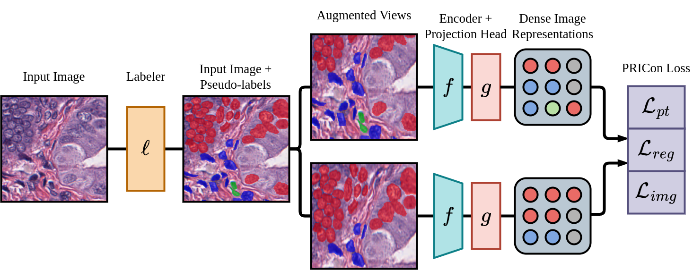

# Point Region Image-level Contrast
Official repository for "Pseudo-label Guided Join Point Region Image-level Contrastive Learning for Task-specific Pretraining".




### Requirements
- Python 3.8+
- `pip install -r requirements.txt`


### Data Preparation
- Masks are expected to be single channel images at the same resolution as their corresponding image and consist of integer values between `[0, number-of-classes - 1]` where `number-of-classes` is the number of pseudo-label classes (including background).
    - The [ `segmentation/` ](segmentation/) directory includes code to train a labeler network and [ `segmentation/scripts/generate_masks.py` ](segmentation/scripts/generate_masks.py) can be used to generate pseudo-label masks for a dataset using a trained model.

- Images and masks are expected to be in the correct order when the python `sort()` function is applied.
    - i.e. Images and masks should have the same base name.

### Usage
#### _Training_
- To train with default settings run:
```
python train.py --gpus 1 --precision 16 --max_epoch 100 --data.image_dir path/to/images/ 
--data.mask_dir path/to/masks/ --data.n_classes <number-of-classes> --data.batch_size 256
```
- `<number-of-classes>` is the number of pseudo-label classes that the masks consist of.    
- [`configs/`](configs/) contains example configuration files and can be run with `python train.py --config path/to/config/file`.
- Run `python train.py --help` for information on all options.


#### _Fine-tuning_
- To get the encoder weights from a pretraining checkpoint run:
```
python scripts/extract_encoder_weights.py --checkpoint path/to/pricon/checkpoint/  
--output path/to/output/weights/
```
- The [`segmentation/`](segmentation/) contains training code for fine-tuning segmentation models using the extracted pretrained encoder weights.


#### _Cyclic Training_
After pretraining and fine-tuning the first time, generate new pseudo-label masks with the fine-tuned model by running:
```
python segmentation/scripts/generate_masks.py -w path/to/segmentation/checkpoint 
-i  path/to/unlabeled/images/
```
Next resume pretraining by running:
```
python train.py ... --model.resume_checkpoint path/to/pricon/checkpoint 
--data.mask_dir path/to/new/masks/ 
```
where `path/to/pricon/checkpoint` is the checkpoint file from the previous pretraining run. 
